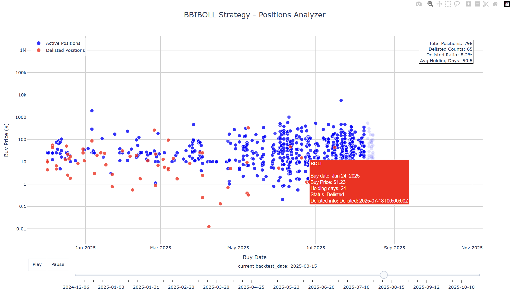
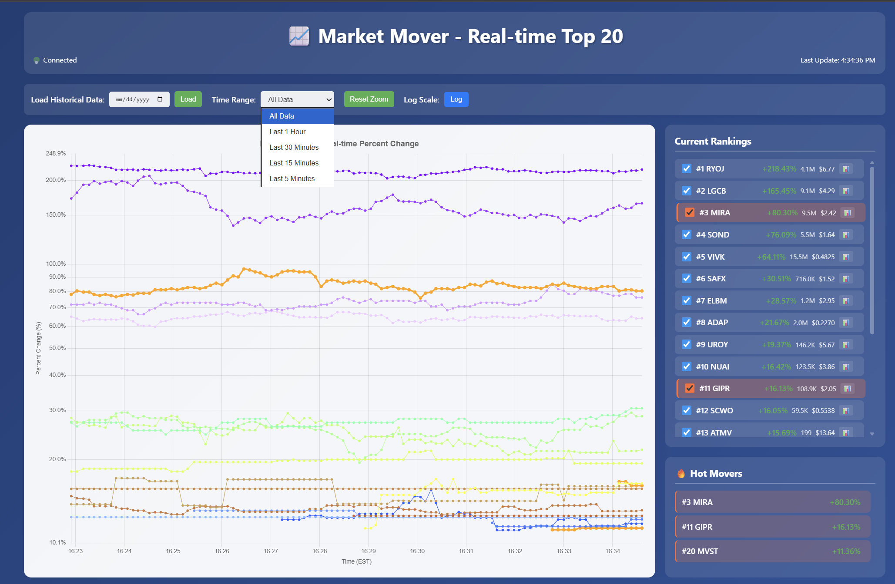

# Table of Contents

* [Document](#document)
  * [data_fecther](#data_fecther)
  * [cores](#cores)
  * [backtest](#backtest)
  * [live_monitor](#live_monitor)
* [Change Log](#change-log)
* [Roadmap](#roadmap)

---

## Document

### `data_fecther`

This directory handles **data download & save**.

I use a bash scripts [`scripts/weekly_update.sh`](scripts/weekly_update.sh) to handle all the data_fecther process in one. You can walk through each file below to pick what you need.

### 1. Polygon.io Flat File Downloader

Use prefixes to download specific files by **date range** or **recent days**.

    python src/data_fecther/polygon_downloader.py \
        --asset-class us_stocks_sip \
        --data-type minute_aggs_v1 \
        --recent-days 7

* First Time Setup

    1. Configure your data directory in `cores/config.py`
    2. Suggested file structure:

            ├── lake/          # parquet files
            │   ├── us_options_opra/trades_v1
            │   └── us_stocks_sip/{day_aggs_v1, minute_aggs_v1}
            ├── processed/     # cache
            │   └── us_stocks_sip/day_aggs_v1
            └── raw/           # original csv.gz files
                ├── global_crypto/minute_aggs_v1
                ├── us_indices/{day_aggs_v1, minute_aggs_v1, us_all_indices}
                ├── us_options_opra/{day_aggs_v1, minute_aggs_v1, quotes_v1, trades_v1}
                └── us_stocks_sip/{day_aggs_v1, minute_aggs_v1, splits, us_all_tickers}

* File Size Reference (per year)

    | Data Type        | Stock | Option | Indice | Forex     | Crypto |
    | ---------------- | ----- | ------ | ------ | --------- | ------ |
    | Day Aggregate    | 50 MB | 600 MB | 80 MB  | 8 MB      | 5 MB   |
    | Minute Aggregate | 4.5GB | 4.5GB  | 25 GB  | 3 GB      | 1 GB   |
    | Trades           | 350GB | 10 GB  | —      | —         | 15 GB  |
    | Quotes           | 1.5TB | 22 TB  | 2TB/M  | 100GB/day | 60 GB  |

---

### 2. CSVGZ → Parquet Conversion

For faster access using Polars.

    # Convert recent 7 days
    python src/data_fecther/csvgz_to_parquet.py \
        --asset-class us_stocks_sip \
        --data-type day_aggs_v1 \
        --recent-days 7

Other options:`--file`, `--directory`, `--asset-class`, `--date-range`, `--info`, `--list-schemas`.

---

### 3. Splits Adjustment

splits&merge data are from Polygon.io, and there will be some discrepancy, and you can customize by editing `splits_error.csv`.

I have left mine in[`src/data_fecther/data_discrepancy_fixed/splits_error.csv`](src/data_fecther/data_discrepancy_fixed/splits_error.csv), which comes from my experience, you can use it as a reference.

* Example:

| id         | execution\_date | split\_from | split\_to | ticker | error\_type |
| ---------- | --------------- | ----------- | --------- | ------ | ----------- |
| E1a3…625   | 2025-07-17      | 7.0         | 8.0       | ENVX   | remove      |
| fixed\_dxf | 2024-12-04      | 125.0       | 1.0       | DXF    | add         |

`error_type` → determines whether to **remove** or **add** split events.

---

### `cores`

This directory includes **configs, loaders, and plotting tools**.

### 1. config

    Defined in `config.py`.

### 2. data_loader

    Core of the project.
    Loads data from configured directories using **Polars**.

### 3. plotter

    Based on `seolpyo_mplchart` (wrapper around Matplotlib).

    * Simple to configure
    * Good appearance
    * have basic chart elements

### `backtest`

### 1. Backtest Engine

### 2. StrategyBase

### 3. Backtester

### 4. Results Analyzer

### `live_monitor`

### 1. market_mover_monitor

    This is a another huge part of this project, which concentrates on the US pre-market trading.

1.1. Analyzer and Plotter

First start the web dashboard,

    python src/live_monitor/market_mover/start.py web

Open `http://localhost:5000`, then choose the data supply,see below. And you will see Top20 tickers updated continuously.

You can highlight the tickers line, choose the timeframe, see the Hot Movers etc....

1.2. Data Supply

1.2.1. `collector.py`

Using the polygon api collect the real time market snapshot, using html+css+js to monitor the real time market mover to get a early catch on.

    python src/live_monitor/market_mover/start.py collector

1.2.2. `replayer.py`

Replay data that collector have fecthed and saved to `analyzer`.

    python src/live_monitor/market_mover/start.py replay --date 20251016 --speed 5.0

1.2.3. `trades_replayer`

Aggregate the trades level flatfile data to `analyzer`.

    python src/live_monitor/market_mover_monitor/start.py replay --date 20251016 --speed 5.0 --type trade_replay

**Currently it's only a dashboard, though enough for a hands-on trader, more mathematical analysis and data process to be added.**

---

## Change Log

2025-09-19

* ✅ Changed `splits_error` handling → now supports flexible CSV editing (add/remove error types).

2025-09-20

* ✅ `csvgz_to_parquet.py` now supports **recent-days convert**.

* ✅ Added **Longbridge watchlist import** feature.

* ✅ changed the structure from _src/quant101/*_ to _src/*_

2025-09-21

* ✅ Improved **alignment**: use both `composite_figi`&`share_class_figi` to align and make sure as much as possible.

2025-09-22

* ✅ `config.py` reconstructed, add data with error correction fuction.

* ✅ add one `stocks_error.csv`.

2025-09-24

* 🥹 `low_volume_tickers.csv` the specious low volume tickers have too much to examined and each case seems to be different, which would cost too much time for me to do it.
And the most important part about low_volume_tickers is that it can show the correctness of your data load process. As you can find some notes in the [`src/data_fecther/data_discrepancy_fixed/low_volume_tickers_copy.csv`](src/data_fecther/data_discrepancy_fixed/low_volume_tickers_copy.csv).
For example, most of the long-term like over years 0 volume is because of relisted on the market or there is a new ticker has the same name, which complicates the situation now for it's hard to distinguish. So, as for now, 2025-09-24, I have decided to leave this tickers(max_duration_days > 50) as skipped tickers. I know it's unwise, but it saves me time for now.

2025-09-27

* ✅ add strategies indicators, registry version.

* ✅ BBIBOLL Strategy signal and trade rule established.

* ✅ add risk-free rate to fix sharpe ratio calculate.

2025-09-30

* ✅ add quantstats

2025-10-02

* ✅ add redis for market mover monitor collector and analyzer.

2025-10-04

* ✅ add market mover replayer.
* ✅ More universal indicator calculator.

2025-10-07

* ✅ market live monitor web version

2025-10-12

* ✅ update versatile_tickers_fetch.py
* ✅ update weekly_update.sh in scripts
* ✅ add file_examiner in scripts

2025-10-20

* ✅ market live monitor trades timespan replayer

2025-10-23

* ✅ market live monitor trades timespan replayer v2 & v3(v2 is better.) optimized, data_manager add last_df to concate for v2.

2025-10-27

* ✅ updated README.md
* ✅ add trades_analyzer.py

2025-11-12

* ✅ removed Chinese. From now on, English will be used as the default language for this project.
* ✅ add trades_analyzer.py

2025-11-24

* ✅ redis to redis stream
* ✅ reconstructing MMM
* ✅ float shares fetcher and MMM add float shares display.

2025-11-26

* ✅ added borrow_fee.
* ✅ Async fetch and union float shares.

---

## Roadmap

* features to be add:
* [ ] universal indicator plot
* [ ] Develop more startegies. Build a robust backtest signal generator and trade rules engine.
* [ ] Polish **X news search function**.
* [ ] Polars ETL + numba backtest engine(long-term)
* [ ] market live monitor replay rewrite to web-embedded with play, pause, play back and speed control.

* bugs to be fixed:
* [ ] backtest engine needed rewrite.
* [ ] backtest open positions need to be fixed.
* [ ] Stock dividends
* [ ] low_volume_tickers.csv, see more detail below in the changelog.

---
