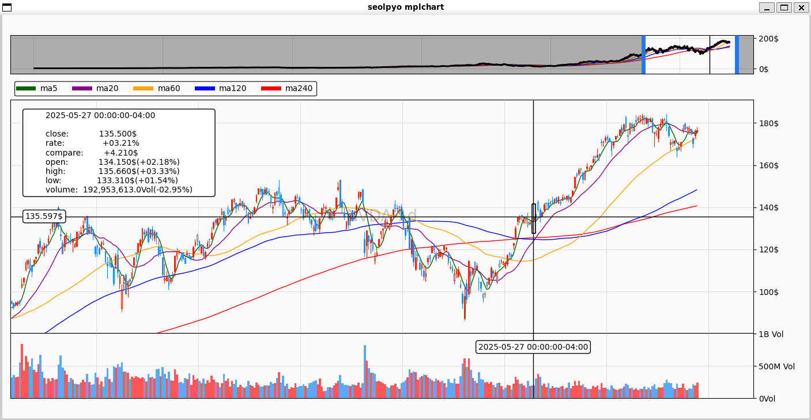

---
# Table of Contents

* [Roadmap](#roadmap)
* [Document & Guide (Detailed)](#document--guide-detailed)
    * [data_1](#data_1)
    * [core_2](#core_2)
    * [live_trade](#live_trade)
* [Change Log](#change-log)
---

# Roadmap

## On-Going

## To-Do

* [ ] Add **`data_error.csv`**, similar to `splits_error.csv`.
* [ ] Polish **X news search function**.
* [ ] Add **trade volume filter** or other ticker filter conditions.

---

# Document & Guide (Detailed)

## `data_1`

This directory handles **data download & save**.

### 1. Polygon.io Flat File Downloader

    Use prefixes to download specific files by **date range** or **recent days**.

```bash
# Download recent 7 days
python src/data_1/polygon_downloader.py \
    --asset-class us_stocks_sip \
    --data-type minute_aggs_v1 \
    --recent-days 7
```

### ⚡ First Time Setup

1. Configure your data directory in
   `core_2/config.py`
2. Suggested file structure:

```
├── lake/          # parquet files
│   ├── us_options_opra/trades_v1
│   └── us_stocks_sip/{day_aggs_v1, minute_aggs_v1}
├── processed/     # cache
│   └── us_stocks_sip/day_aggs_v1
└── raw/           # original csv.gz files
    ├── global_crypto/minute_aggs_v1
    ├── us_indices/{day_aggs_v1, minute_aggs_v1, us_all_indices}
    ├── us_options_opra/{day_aggs_v1, minute_aggs_v1, quotes_v1, trades_v1}
    └── us_stocks_sip/{day_aggs_v1, minute_aggs_v1, splits, us_all_tickers}
```

### 💾 File Size Reference (per year)

| Data Type        | Stock | Option | Indice | Forex     | Crypto |
| ---------------- | ----- | ------ | ------ | --------- | ------ |
| Day Aggregate    | 50 MB | 600 MB | 80 MB  | 8 MB      | 5 MB   |
| Minute Aggregate | 4.5GB | 4.5GB  | 25 GB  | 3 GB      | 1 GB   |
| Trades           | 350GB | 10 GB  | —      | —         | 15 GB  |
| Quotes           | 1.5TB | 22 TB  | 2TB/M  | 100GB/day | 60 GB  |

---

### 2. CSVGZ → Parquet Conversion

    For faster access using Polars.

```bash
# Convert recent 7 days
python src/data_1/csvgz_to_parquet.py \
    --asset-class us_stocks_sip \
    --data-type day_aggs_v1 \
    --recent-days 7
```

Other options:`--file`, `--directory`, `--asset-class`, `--date-range`, `--info`, `--list-schemas`.

---

### 3. Splits Adjustment

    splits&merge data are from Polygon.io, and there will be some discrepancy, and you can customize by editing `splits_error.csv`.
I have left mine in[`src/data_1/data_discrepancy_fixed/splits_error.csv`](src/data_1/data_discrepancy_fixed/splits_error.csv), which comes from my experience, you can use it as a reference.

* Example:

| id         | execution\_date | split\_from | split\_to | ticker | error\_type |
| ---------- | --------------- | ----------- | --------- | ------ | ----------- |
| E1a3…625   | 2025-07-17      | 7.0         | 8.0       | ENVX   | remove      |
| fixed\_dxf | 2024-12-04      | 125.0       | 1.0       | DXF    | add         |

`error_type` → determines whether to **remove** or **add** split events.

---

## `core_2`

This directory includes **configs, loaders, and plotting tools**.

### 1. config

    Defined in `config.py`.

### 2. data_loader

    Core of the project.
    Loads data from configured directories using **Polars**.

### 3. plotter

    Based on `seolpyo_mplchart` (wrapper around Matplotlib).

    * Simple to configure
    * Good appearance
    * have basic chart elements

<p align="center">
  
</p>

## `live_trade`

### live_news_fetcher

    grab the latest news of tickers.

### market_mover_monitor

    prototype for pre-market momentum trading.
---

# Change Log

**2025-09-19**
* ✅ Changed `splits_error` handling → now supports flexible CSV editing (add/remove error types).

**2025-09-20**
* ✅ `csvgz_to_parquet.py` now supports **recent-days convert**.
* ✅ Added **Longbridge watchlist import** feature.
* ✅ changed the structure from _src/quant101/*_ to _src/*_

**2025-09-21**
* ✅ Improved **alignment**: use both `composite_figi`&`share_class_figi` to align and make sure as much as possible.

**2025-09-22**
* ✅ `config.py` reconstructed, add data with error correction fuction.
* ✅ add one `stocks_error.csv`.

**2025-09-24**
* 🥹 `low_volume_tickers` the specious low volume tickers have too much to examined and each case seems to be different, which would cost too much time for me to do it.
And the most important part about low_volume_tickers is that it can show the correctness of your data load process. As you can find some notes in the [`src/data_1/data_discrepancy_fixed/low_volume_tickers_copy.csv`](src/data_1/data_discrepancy_fixed/low_volume_tickers_copy.csv).
For example, most of the long-term like over years 0 volume is because of relisted on the market or there is a new ticker has the same name, which complicates the situation now for it's hard to distinguish. So, as for now, 2025-09-24, I have decided to leave this tickers(max_duration_days > 50) as skipped tickers. I know it's unwise, but it saves me time for now.

---
